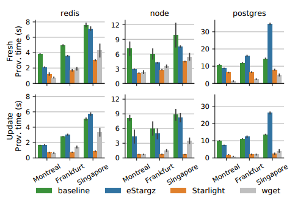

# Starlight: Fast Container Provisioning

[](https://github.com/mc256/starlight/actions/docker-image.yml)
[](https://github.com/mc256/starlight/actions/helm-chart.yml)
[](https://github.com/mc256/starlight/actions/debian-package.yml)
[](https://github.com/mc256/starlight/releases)


Starlight is an accelerator for provisioning container-based applications.
It speeds up deploying and updating containers on workers inside and outside the cloud, 
while maintaining backwards compatibility with existing tools.
It is so fast that containers can start faster than merely downloading an optimized data package, 
yet with practically no overhead. 

The image on the right compares time to download and start containers using containerd ("baseline"), [eStargz](https://github.com/containerd/stargz-snapshotter/blob/main/docs/estargz.md), Starlight, and the time it takes to download an optimized update package using wget. 
The registry is in North Virginia.
Top row shows time to deploy a container to an empty worker, and bottom row time to update the container to a later version.
Read our [NSDI 2022 paper](https://www.usenix.org/conference/nsdi22/presentation/chen-jun-lin) for more results.

### Extend cloud practices to the edge and WAN
Using containers to provision workers in high-latency or low-bandwidth environments can be tricky.
The time it takes to deploy software and start a container increases dramatically with latency, 
and increases at a higher rate than the equivalent time to simply download the data.
Outside the datacenter, where round-trip times are in the order of tens or hundreds of milliseconds, 
container provisioning can be several times slower than in the cloud, even when the network has reasonable bandwidth.

### Why is container provisiong slow?
The root cause for this slow provisioning time is the overall design of the provisioning pipeline: 
it is pull-based, designed around the stack-of-layers abstraction container images, 
and does not explicitly consider container updates.
For example, updating a Java application to fix the Log4j vulnerability usually requires re-downloading the entire container image, even though the updated Log4j library only takes a fraction of that space. 
This can make provisioning slower than it should be even inside cloud data centers.

### How do we address this?
Starlight decouples the mechanism of container provisioning from container development.
Starlight maintains the convenient stack-of-layers structure of container images, 
but uses a different representation when deploying them over the network.
The development and operational pipelines remain unchanged.
<br>[See how Starlight works ➡️](https://github.com/mc256/starlight/blob/master/docs/starlight-workflow.md) or [read our NSDI 2022 paper](https://www.usenix.org/conference/nsdi22/presentation/chen-jun-lin).

## Architecture
Starlight is implemented on top of **containerd**. It is comprised of cloud and worker components.
* A **proxy** server on the cloud side mediates between Starlight workers and any standard registry server.
* On the worker side, a **command line tool** tells Starlight to PULL containers.
* A **Starlight daemon** (snapshotter plugin) runs belongs the containerd of each worker node.

## Getting Started


Starlight is compatible with Kubernetes and can replace the default `overlayfs` snapshotter.
We could use helm to deploy Starlight on a Kubernetes cluster.

- [I am familiar with **K8s** & Helm. **TL;DR**](https://github.com/mc256/starlight/blob/master/docs/helm.md)
- [I have 2 **Virtual Machines**, but **TL;DR**](https://github.com/mc256/starlight/blob/master/docs/newbie.md)

---

Suppose you have a container on a [OCI compatible **registry**](https://github.com/distribution/distribution) that you want to deploy.
You need to:

1) Set up a **Starlight proxy**, 
ideally close to the **registry** server you are using. Configure the proxy server to point to the registry and run it.
Starlight supports any standard registry. (It can be deployed to k8s using ***Helm***)
<br>[Find out how to install **Starlight proxy** ➡️](https://github.com/mc256/starlight/blob/master/docs/starlight-proxy.md) 


2) Set up the worker to be able to run Starlight. 
This involves 
installing **containerd** and the **Starlight snapshotter plugin**, 
configuring containerd to use the plugin, 
and starting the Starlight snapshotter daemon
(you also need to tell the snapshotter the address of the proxy server).
<br>[Find out how to install **containerd** & **Starlight snapshotter plugin** ➡️](https://github.com/mc256/starlight/blob/master/docs/starlight-snapshotter.md)


3) Convert the container image to the **Starlight format** container image.
   More specifically, the storage format of the compressed layers needs to be converted to the Starlight format and then the layers stored in the registry. 
   The Starlight format is **backwards compatible** and almost the same size, so there is no need to store compressed layers twice. In other words, non-Starlight workers will descrompress Starlight images with no chanages.
   The **Starlight CLI tool** features the image conversion, example:
   ```shell
    ctr-starlight convert --notify \
      --platform=linux/amd64 \
      docker.io/library/redis:6.2.7 harbor.yuri.moe/x/redis:6.2.7
   ```
    In addition, the proxy needs some metadata about the list of files in the container to compute the data for deployment. 
    The `--nofity` flag tells the proxy to fetch the metadata from the registry and store it in the metadata database.


4) Collect traces on the worker for container startup. 
   This entails starting the container on the worker while collecting file access traces that are sent to the proxy.
   
   The **Starlight CLI tool** features trace collection, example:
   ```shell
   sudo ctr-starlight optimizer on
   sudo ctr-starlight pull harbor.yuri.moe/x/redis:6.2.7 && \
   mkdir /tmp/redis-data && \
   sudo ctr c create --snapshotter=starlight \
        --mount type=bind,src=/tmp/redis-data,dst=/data,options=rbind:rw \
        --env-file ./demo/config/all.env --network=host \
        harbor.yuri.moe/x/redis:6.2.7
        instance1 && \
   sudo ctr t start instance1
   ```
   
   You may terminate the container using `Ctrl-C` and turn off the optimizer using 
   ```shell
   sudo ctr-starlight optimizer off
   ```
   
   We could repeat this process several times, then can report all the traces to the proxy, using:
   ```shell
   sudo ctr-starlight report
   ```

5) Reset `containerd` and `starlight`. Clean up all the downloaded containers and cache.
   ```shell
   sudo ./demo/reset.sh
   ```

🙌 That's it! You can now deploy the container to as many Starlight workers as you want, and it should be fast!

Note step **2** must be done on each worker, and steps **3** and **4** must be done for every container image you want to deploy using Starlight. 
The good news is that they should be quick, a few minutes for each container.

## Deploying containers

Start a container using Starlight
```shell
sudo ctr-starlight pull harbor.yuri.moe/starlight/redis:6.2.7 && \
mkdir /tmp/test-redis-data && \
sudo ctr c create \
    --snapshotter=starlight \
    --mount type=bind,src=/tmp/test-redis-data,dst=/data,options=rbind:rw \
    --env-file ./demo/config/all.env \
    --net-host \
    harbor.yuri.moe/x/redis:6.2.7 \
    instance3 && \
sudo ctr t start instance3
```

Update a container using Starlight (Step 3 and Step 4 need to be done for `redis:7.0.5`)
```shell
sudo ctr-starlight pull harbor.yuri.moe/starlight/redis:7.0.5 && \
sudo ctr c create \
    --snapshotter=starlight  \
    --mount type=bind,src=/tmp/test-redis-data,dst=/data,options=rbind:rw \
    --env-file ./demo/config/all.env \
    --net-host \
    harbor.yuri.moe/x/redis:7.0.5 \
    instance4 && \
sudo ctr t start instance4
```

For more information, please check out `ctr-starlight --help` and `starlight-daemon --help`


## Citation
If you find Starlight useful in your work, please cite our NSDI 2022 paper:
```bibtex
@inproceedings {chen2022starlight,
    author = {Jun Lin Chen and Daniyal Liaqat and Moshe Gabel and Eyal de Lara},
    title = {Starlight: Fast Container Provisioning on the Edge and over the {WAN}},
    booktitle = {19th USENIX Symposium on Networked Systems Design and Implementation (NSDI 22)},
    year = {2022},
    address = {Renton, WA},
    url = {https://www.usenix.org/conference/nsdi22/presentation/chen-jun-lin},
    publisher = {USENIX Association},
    month = apr,
}
```


## Roadmap
Starlight is not complete. Our roadmap:

| Version                                                  | Status  | Scheduled Release |
|----------------------------------------------------------|---------|-------------------|
| [v0.1.3](https://github.com/mc256/starlight/tree/v0.1.3) |         |                   |
| [v0.2.7](https://github.com/mc256/starlight/tree/v0.2.7) | stable  |                   |
| [v0.3.0](https://github.com/mc256/starlight/tree/)       | develop | 2022-12-15        |
| v0.4.0                                                   |         | 2023-01-15        |
| v0.5.0                                                   |         | 2023-02-15        |

Feature List:
- [x] Scalable database backend (v0.2)
  - [x] Postgres Database Schema (v0.2)
  - [x] Starlight Proxy Server (v0.2)
- [x] Kubernetes support (v0.3)
  - [x] Starlight Proxy (v0.2)
    - [x] Helm Chart (v0.2)
    - [x] Starlight Proxy authentication (v0.2)
  - [x] New Starlight Snapshotter / Content Plugin for containerd (v0.2)
  - [x] initContainer tool (v0.3)
- [ ] OCI container registry support (v0.4)
  - [x] Goharbor support (v0.2)
  - [x] Multiple platforms image support (v0.2) 
  - [ ] Goharbor Hook/ Scanner for automatic image conversion (v0.4)
  - [x] Jointly optimizing multiple containers deployments (v0.4)
  - [ ] Converting containers that have already been fully retrieved using Starlight to use OverlayFS. (v0.4)
- [ ] Starlight new features (v0.5)
  - [ ] Resume interrupted pull connection (v0.4)
  - [ ] Garbage Collection (v0.4)