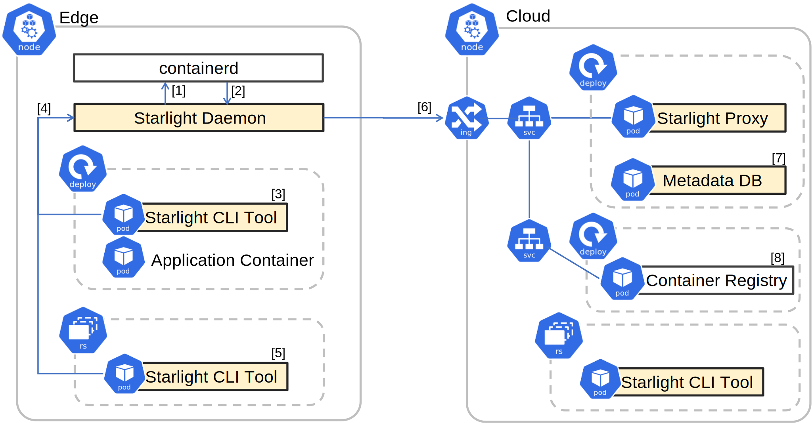

# Starlight Helm Package

## TL;DR

```shell
helm show values oci://ghcr.io/mc256/starlight/starlight \
     --version 0.3.2 > ./my-values.yaml
```

Take a look at `./my-values.yaml` and edit it to your liking. 
In most cases, you will want to change `cloudNodeSelector` and `edgeNodeSelector` to 
make sure that the pods are scheduled on the correct nodes.
You make also need to take a look at the `ingress` section and change the `host` and `ingressClassName`.

Then give it a shot:
```shell
helm upgrade --install -f ./my-values.yaml \
     starlight \
     oci://ghcr.io/mc256/starlight/starlight \
     --version 0.3.2
```

## Prerequisites

The current deployment has been tested in this environment:

- Kubernetes 1.24+
- Helm 3.9.0+
- PV provisioner support in the underlying infrastructure
- ReadWriteOnce volumes persistence storage
- Linux kernel 5.15.0+ (edge node)

How to set up an easy kubernetes cluster on your local machine? 
Check out [this blog post](https://note.mc256.dev/2023/01/how-to-setup-kubernetes-k3s-in-two-nodes.html).

## Install

This chart bootstraps a **Starlight Proxy** deployment on a Kubernetes cluster.

It also comes with a **[Container Registry (v2)](https://github.com/distribution/distribution)**, 
**[a PostgresQL as the metadata database](https://www.postgresql.org/)** 
and **[Adminer for managing the database](https://www.adminer.org/)** 
in the default deployment for convenience and can be disabled by setting the parameters.




1. Some components require persistence storage. We cloud use the [Local Path Provisioner](https://github.com/rancher/local-path-provisioner) 

    ```shell
    kubectl apply -f \
      https://raw.githubusercontent.com/rancher/local-path-provisioner/v0.0.23/deploy/local-path-storage.yaml
      
    kubectl patch storageclass local-path \
      -p '{"metadata": {"annotations":{"storageclass.kubernetes.io/is-default-class":"true"}}}'
    ```

2. On the edge node we need to install **Starlight Daemon** and connect <sup>[1]</sup> it to **containerd**.
    ```shell
    export ARCH=$(dpkg --print-architecture) # one of amd64, arm64, armhf
    wget https://github.com/mc256/starlight/releases/download/v{{ .Chart.Version }}/starlight_{{ .Chart.Version }}_$ARCH.deb
    sudo dpkg -i starlight_{{ .Chart.Version }}_$ARCH.deb
    ```
   
    if you are using k3s, change containerd's socket address in `/etc/starlight/daemon.json`
    ```json
    { 
      "containerd": "/run/containerd/containerd.sock"
    }
    ```
3. Configure **containerd** to use <sup>[2]</sup> Starlight as its default 
    [snapshotter plugin](https://github.com/containerd/containerd/blob/main/docs/PLUGINS.md)

    Add the following to `/etc/containerd/config.toml`:
    ```toml
    [plugins]
      [plugins."io.containerd.grpc.v1.cri".containerd]
        snapshotter = "starlight"
    [proxy_plugins]
      [proxy_plugins.starlight]
        type = "snapshot"
        address = "/run/starlight/starlight-snapshotter.sock"
    ```
    if file does not exist, create it using 

    ```shell 
    mkdir /etc/containerd && containerd config default > /etc/containerd/config.toml`
    ```
   
    if you are using k3s, copy the default configuration, and change containerd's config in `/var/lib/rancher/k3s/agent/etc/containerd/config.toml.tmpl`
    ```shell
    cp /var/lib/rancher/k3s/agent/etc/containerd/config.toml /var/lib/rancher/k3s/agent/etc/containerd/config.toml.tmpl
    ```
   
    Restart containerd to apply the changes
    ```shell
    systemctl restart containerd
    # For k3s, use
    # systemctl restart k3s-agent
    ```

4. Add proxy configuration<sup>[6]</sup> to **Starlight Daemon** .
    We can SSH into the Starlight CLI Tool pods in the edge node <sup>[5]</sup>.
    ```shell
    kubectl exec --stdin --tty `kubectl get pods --selector=app.kubernetes.io/component=edge,app.kubernetes.io/name=starlight -o jsonpath='{.items[0].metadata.name}'` -- /bin/sh
    ```
    
    Then add a proxy using the Starlight CLI tool. (Please change to the domain name in `.Values.ingress.host`)
    
    ```shell
    ctr-starlight add-proxy in-cluster http YOUR_DOMAIN_NAME
    ```
    
    Test the connection<sup>[6]<sup>
   ```shell
   ctr-starlight test in-cluster
   # ping test success: ok! - https://starlight.mc256.dev
   # latency: 721 ms
   ```


## Uninstall

```shell
helm uninstall starlight
```

## Parameters
Please see the comments in the [`values.yaml`](https://github.com/mc256/starlight/blob/master/demo/chart/values.yaml) file.


## How to use Starlight on the edge?

We can use Starlight to pull container image in the `initContainers`. 
The Starlight CLI talks to the Starlight Daemon via gRPC socket to request the image
```yaml
  initContainers:
  - name: init-redis
    image: ghcr.io/mc256/starlight/cli:latest
    command:
    - /opt/ctr-starlight  
    - pull 
    - --profile
    - in-cluster
    - starlight-registry.default.svc.cluster.local:5000/redis:6.2.7
    env:
    - name: CONTAINERD_NAMESPACE
      value: "k8s.io"
    volumeMounts:
    - name: socket
      mountPath: /run/starlight
```

The following is a complete example of the a Redis deployment:
```yaml
apiVersion: apps/v1
kind: Deployment
metadata:
  name: test-redis
spec:
  selector:
    matchLabels:
      app: test-redis
  template:
    metadata:
      labels:
        app: test-redis
    spec:
      volumes:
      - name: socket
        hostPath:
          path: /run/starlight
      - name: redis-pvc
        persistentVolumeClaim:
          claimName: redis-pvc
      initContainers:
      - name: init-redis
        image: ghcr.io/mc256/starlight/cli:latest
        #command:  ["/bin/sh", "-ec", "while :; do echo '.'; sleep 60 ; done"]
        command:
        - /opt/ctr-starlight  
        - pull 
        - --profile
        - in-cluster
        - starlight-registry.default.svc.cluster.local:5000/redis:6.2.7
        env:
        - name: CONTAINERD_NAMESPACE
          value: "k8s.io"
        volumeMounts:
        - name: socket
          mountPath: /run/starlight
      containers:
      - name: test-redis
        image: starlight-registry.default.svc.cluster.local:5000/redis:6.2.7
        securityContext:
          runAsUser: 999
          allowPrivilegeEscalation: false
        resources:
          limits:
            memory: "128Mi"
            cpu: "500m"
        ports:
        - containerPort: 6379
        volumeMounts:
        - mountPath: /data
          name: redis-pvc
          subPath: redis
          
---
apiVersion: v1
kind: PersistentVolumeClaim
metadata:
  labels:
    io.kompose.service: redis-pvc
  name: redis-pvc
spec:
  storageClassName: "local-path"
  accessModes:
    - ReadWriteOnce
  volumeMode: Filesystem
  resources:
    requests:
      storage: 256Mi
```

Having questions? Please [create an issue here](https://github.com/mc256/starlight/issues/new?assignees=m256&labels=&template=question.md&title=)