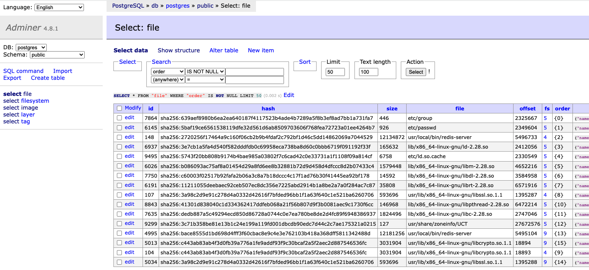

# TL;DR All-in-one Quick Start Guide

To finish this guide, you will need TWO machines (or VMs) far away from each other. 
One acts as the Cloud, and the other acts as the Edge. You will need to identify the IP address of the Cloud server.

The following instructions have been tested using AWS EC2 t2.micro with Ubuntu 22.04 LTS and `starlight v0.3.2`.

`git checkout v0.3.2`

---

## The "Cloud"

In this machine you will need to set up the Starlight Proxy and a standard container registry. 
If you are using AWS EC2, please add the following ports to the Security Group whitelist when you create the VM:
 - TCP 8090: Starlight Proxy (set the source to be your VPC)
 - TCP 8080: Adminer - for Metadata database  (set the source to be your own IP)
 - TCP 5000: Container Registry  (set the source to be your VPC)
 - TCP 80: Container Registry (set the source to be your VPC)


1. Change the hostname of the server (Don't copy and paste, replace `<ip address>` with your server's IP address)

    ```shell
    echo "cloud" | sudo tee /etc/hostname > /dev/null
    sudo hostname -F /etc/hostname
    echo "<ip address> cloud.cluster.local" | sudo tee -a /etc/hosts > /dev/null
    ```

2. Install [Docker](https://docs.docker.com/engine/install/ubuntu/#install-using-the-repository) and [Docker Compose](https://docs.docker.com/compose/install/)  

    If using Ubuntu 22.04 LTS, you could install Docker and Docker Compose using the following commands: 
    ```shell
    sudo apt update && \
    sudo apt upgrade -y && \
    sudo apt install -y docker-compose && \
    sudo usermod -aG docker $USER
    ```
    After adding the current user to the `docker` group, you (may) **need to log out and log in** to take effect.
    To confirm that Docker is working with correct permission, `docker ps` should not print any errors.
    ```shell
    docker ps
    # CONTAINER ID   IMAGE     COMMAND   CREATED   STATUS    PORTS     NAMES
    ```
   
3. Clone this project and launch the registry and proxy containers from `./demo/compose/registry+proxy`

    ```shell
    git clone https://github.com/mc256/starlight.git && \
    cd starlight/demo/compose/registry+proxy && \
    git checkout v0.3.1 && \
    docker-compose up -d
    # Creating network "registryproxy_default" with the default driver
    # Creating registryproxy_db_1       ... done
    # Creating registryproxy_registry_1 ... done
    # Creating registryproxy_dbadmin_1  ... done
    # Creating registryproxy_proxy_1    ... done
    ```
    The Starlight proxy writes image metadata to the Postgres database, and
    the container registry saves container images to `./data_registry`.

    
3. Verify the registry and proxy are running.
    ```shell
    # This checks the Starlight Proxy
    curl http://cloud.cluster.local:8090/
    # {"status":"OK","code":200,"message":"Starlight Proxy"}
    # This checks the container registry
    curl http://cloud.cluster.local:5000/v2/
    # {}
    ```

    If it does not work, please restart the containers after the database has been created (missing a db health check).
    We could put a Nginx reverse proxy to handle SSL certificates or load balancing.
    But for simplicity, this part is ignored in this example.


3. Adjust the TCP window size (Optional). 
   If the edge node is far away, we will need to adjust the TCP window size so that the connection can speed up to the speed limit faster. (You could calculate the best TCP window size using https://www.speedguide.net/bdp.php later)
   If you skip this step, the connection will be much slower (the impact on speed is worse for other methods!).

    ```shell
    cat <<EOT | sudo tee -a /etc/sysctl.conf > /dev/null
    net.core.wmem_max=125829120
    net.core.rmem_max=125829120
    net.ipv4.tcp_rmem= 10240 87380 125829120
    net.ipv4.tcp_wmem= 10240 87380 125829120
    net.ipv4.tcp_window_scaling = 1
    net.ipv4.tcp_timestamps = 1
    net.ipv4.tcp_sack = 1
    net.ipv4.tcp_no_metrics_save = 1
    net.core.netdev_max_backlog = 10000
    EOT
    sudo sysctl -p
    ```

🙌 That's it. Please obtain the IP address of this machine.

---

## The "Edge"

Please get another machine (or VM), you will need to set up a container worker with Starlight Snapshotter plugin.

### 1. Install Dependencies

The worker machine needs `build-essential` and `containerd`.
```shell
sudo apt update && sudo apt upgrade -y && \
sudo apt install -y build-essential containerd
```

Enable `containerd`
```shell
sudo systemctl enable containerd  && \
sudo systemctl start containerd
```

Verify `containerd` is running
```shell
sudo systemctl status containerd
#      Active: active
```

Install Go https://go.dev/doc/install ➡️
```shell
wget https://go.dev/dl/go1.18.3.linux-amd64.tar.gz && \
sudo rm -rf /usr/local/go && sudo tar -C /usr/local -xzf go1.18.3.linux-amd64.tar.gz
```

Add Go to the environment variable (You may want to change `.zshrc` or `.bashrc` file to permanently add this folder to the `PATH` environment variable)
```shell
export PATH=$PATH:/usr/local/go/bin
```

Verify Go is available
```shell
go version
# go version go1.18.3 linux/amd64
```

### 2. (Optional) Tune the network

Adjust the TCP window size. If the edge node is far away, we will need to adjust the TCP window size so that the connection can speed up to the speed limit faster. (You could calculate the best TCP window size using https://www.speedguide.net/bdp.php later)

```shell
cat <<EOT | sudo tee -a /etc/sysctl.conf > /dev/null
net.core.wmem_max=125829120
net.core.rmem_max=125829120
net.ipv4.tcp_rmem= 10240 87380 125829120
net.ipv4.tcp_wmem= 10240 87380 125829120
net.ipv4.tcp_window_scaling = 1
net.ipv4.tcp_timestamps = 1
net.ipv4.tcp_sack = 1
net.ipv4.tcp_no_metrics_save = 1
net.core.netdev_max_backlog = 10000
EOT
sudo sysctl -p
```

### 3. Clone and Build
Clone the Starlight repository
```shell
git clone https://github.com/mc256/starlight.git && \
cd starlight && \ 
git checkout v0.3.1
```

Build the snapshotter plugin and CLI tool
```shell
make starlight-daemon ctr-starlight
```

### 4. Configure Starlight Snapshotter

Find out the IP address / DNS of the Starlight Proxy server and set these two environment variables (Don't Copy-Paste!)
```shell
# DO NOT COPY! 
# This is just an example !!! Get the real address of your server !!!
echo "<ip address> cloud.cluster.local" | sudo tee -a /etc/hosts > /dev/null
````

Verify that the Starlight proxy is accessible from the worker. 
```shell
curl http://cloud.cluster.local:8090/
# {"status":"OK","code":200,"message":"Starlight Proxy"}
curl http://cloud.cluster.local:5000/v2/
# {}
```
If it does not work, please check the firewall configurations, 
Please add port 8090 and 5000 to the firewall whitelist, the worker has to access these ports.

Install Starlight Snapshotter `systemd` service and CLI tool.
```shell
sudo make install install-systemd-service
```

Enable Starlight snapshotter service
```shell
sudo systemctl enable starlight   && \
sudo systemctl start starlight
```

Verify Starlight is running
```shell
sudo systemctl status starlight
# it should be "active".
```

Add Starlight Proxy profile to the Snapshotter's configuration file
```shell
sudo ctr-starlight add myproxy http cloud.cluster.local:8090
```

Confirm that the proxy has been added
```shell
sudo ctr-starlight ls
# [starlight-shared] https://starlight.yuri.moe
#          [myproxy] http://cloud.cluster.local:8090
```

Test the proxy is working
```shell
sudo ctr-starlight test myproxy
# ping test success: ok! - http://cloud.cluster.local:8090
# latency: XX ms
```


### 5. Configure `contaienrd`

Add configuration to `/etc/containerd/config.toml`. 
(If you have set other `proxy_plugins`, please manually edit the file)
```shell
sudo mkdir /etc/containerd/ && \
cat <<EOT | sudo tee -a /etc/containerd/config.toml > /dev/null
  [proxy_plugins]
    [proxy_plugins.starlight]
      type = "snapshot"
      address = "/run/starlight/starlight-snapshotter.sock"
EOT
```

Restart `containerd` service
```shell
sudo systemctl restart containerd
```

Verify the Starlight snapshotter plugin is functioning
```shell
sudo ctr plugin ls | grep starlight 
# io.containerd.snapshotter.v1    starlight                -              ok
```

### 6. Convert Container Image

Convert the container image to the **Starlight format** container image and report to the Starlight proxy.


```shell
sudo ctr-starlight convert \
    --insecure-destination \
    --notify --profile myproxy \
    --platform linux/amd64 \
    docker.io/library/redis:6.2.1 cloud.cluster.local/redis:6.2.1-starlight && \
sudo ctr-starlight convert \
    --insecure-destination \
    --notify --profile myproxy \
    --platform linux/amd64 \
    docker.io/library/redis:6.2.2 cloud.cluster.local/redis:6.2.2-starlight
```

In this example, we load two versions of the Redis container image from docker hub and convert them to the Starlight 
format container image and notify the Starlight proxy (using `--notify` flag).

### 7. Optimize Container Image

Set `starlight` as the default containerd snapshotter in command line (optional).
```shell
export CONTAINERD_SNAPSHOTTER=starlight
```

Collect traces on the worker for container startup.
```shell
sudo ctr-starlight optimizer on && \
sudo ctr-starlight pull --profile myproxy cloud.cluster.local/redis:6.2.1-starlight && \
mkdir /tmp/test-redis-data && \
sudo ctr c create \
   --snapshotter=starlight \
   --mount type=bind,src=/tmp/test-redis-data,dst=/data,options=rbind:rw \
   --env-file ./demo/config/all.env \
   --net-host \
   cloud.cluster.local/redis:6.2.1-starlight \
   instance1 /usr/local/bin/redis-server && \
sudo ctr task start instance1
```

You may terminate the container using `Ctrl-C`, and remove the container:
```shell
sudo ctr container rm instance1
```

Repeat the same thing for `redis:6.2.2`
```shell
sudo ctr-starlight pull --profile myproxy cloud.cluster.local/redis:6.2.2-starlight && \
sudo ctr c create \
   --snapshotter=starlight \
   --mount type=bind,src=/tmp/test-redis-data,dst=/data,options=rbind:rw \
   --env-file ./demo/config/all.env \
   --net-host \
   cloud.cluster.local/redis:6.2.2-starlight \
   instance2 /usr/local/bin/redis-server && \
sudo ctr task start instance2
```

Terminate the container using `Ctrl-C`, and remove the container:
```shell
sudo ctr container rm instance2
```

Report traces to the Starlight Proxy.
```shell
sudo ctr-starlight optimizer off && \
sudo ctr-starlight report --profile myproxy
# set optimizer: completed request
#	sha256:291220ae234f1aa9655359d7e553b05fa9e288fd811b7429f229e5aecd64a181: collected 40.966s file access traces - okay
#	sha256:561c5b8bb95e26feb56b2bfda1d1fe2aee3229e5d9a2cc879e7524f05ad427a8: collected 13.459s file access traces - okay
# reported traces: uploaded traces
```


### 8. Clear all the cache and reset the environment
```shell
# This script will kill containerd and starlight.
# And then it removes ALL contents
# in /var/lib/containerd, /var/lib/starlight, and /tmp/test-redis-data (the redis data directory)
# and unmount all the mount points in /var/lib/starlight/mounts
sudo ./demo/reset.sh 

# Confirm that the cache is cleared
sudo ls -al /var/lib/containerd
# > ls: cannot access '/var/lib/containerd': No such file or directory
sudo ls -al /var/lib/starlight
# > ls: cannot access '/var/lib/starlight': No such file or directory


# restart the processes
sudo systemctl start starlight containerd
```

### 9. (Optional) Check the metadata database

You could also inspect the metadata database using the Adminer Web UI at `http://<public ip address of the cloud>:8080/` (system: `PostgreQL`,server: `db`, username: `postgres`, password is the same as the username).

In the `file` table, you could see it records the access order of the file.




### 10. Deploying and update container

Start a container using Starlight (it should be much faster)
```shell
sudo ctr-starlight pull --profile myproxy cloud.cluster.local/redis:6.2.1-starlight && \
mkdir /tmp/test-redis-data && \
sudo ctr c create \
   --snapshotter=starlight \
   --mount type=bind,src=/tmp/test-redis-data,dst=/data,options=rbind:rw \
   --env-file ./demo/config/all.env \
   --net-host \
   cloud.cluster.local/redis:6.2.1-starlight \
   instance3 /usr/local/bin/redis-server && \
sudo ctr task start instance3
```

Update a container using Starlight (also way faster)
```shell
sudo ctr-starlight pull --profile myproxy cloud.cluster.local/redis:6.2.2-starlight && \
sudo ctr c create \
   --snapshotter=starlight \
   --mount type=bind,src=/tmp/test-redis-data,dst=/data,options=rbind:rw \
   --env-file ./demo/config/all.env \
   --net-host \
   cloud.cluster.local/redis:6.2.2-starlight \
   instance4 /usr/local/bin/redis-server && \
sudo ctr task start instance4
```
