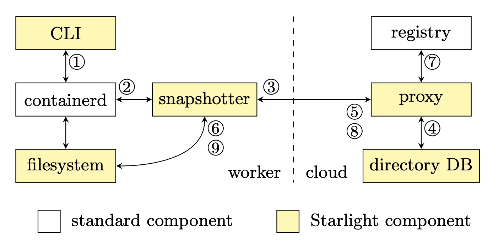

# How Starlight Works (Overview)

Once the user issues a worker `PULL` command to download a set of containers ①,
the command is received by the standard **containerd** daemon.
**containerd** then forwards the command to the **Starlight snapshotter** daemon ②, 
and waits for confirmation that the requested images have been found.
The Starlight snapshotter opens a connection to the **Starlight proxy** 
and sends the list of requested containers as well as the list of relevant containers that already exist on the worker ③. 
The proxy queries the directory database ④ for the list of files in the various layers of the 
requested container image, as well in the image already available on the worker.

The proxy will then begin computing the **delta bundle** that includes the set of distinct compressed file contents that the worker does not already have, specifically organized to speed up deployment;
In the background, the proxy also responds with HTTP 200 OK header to the snapshotter, which notifies **containerd** that the `PULL` phase has finished successfully; the snapshotter however, remains active and keeps the connection open to receive the data from the proxy.
In the background, the proxy issues a series of requests to the registry ⑦ to retrieve the compressed contents of files needed for delta bundle.
Once the contents of the delta bundle has been computed, the proxy creates a **Starlight manifest** (SLM) -- the list of file metadata, container manifests, and other required metadata -- and sends it to the snapshotter ⑤,
which notifies **containerd** that the `PULL` phase has finished successfully.

Please read our [NSDI '22 paper](https://www.usenix.org/conference/nsdi22/presentation/chen-jun-lin) for more details.
